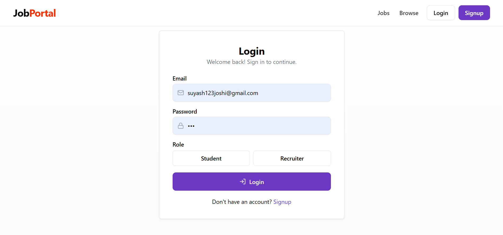
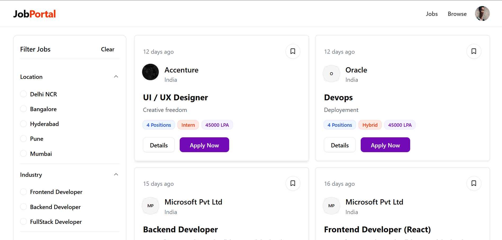

# 💼 Job Hunt Platform

📌 **Overview**  
Job Hunt Platform is a full-stack job portal that connects companies and job seekers.  
It provides a secure and scalable solution for **job postings, applications, and applicant management**.  
The platform ensures smooth performance with **JWT authentication, Redux for state management, and Cloudinary for media storage**.  
Deployed with **Vercel (frontend)** and **Render (backend)** for seamless cloud hosting.  

---

## 🚀 Features
- 👨‍💼 **Company Accounts** – Register companies to post and manage jobs.  
- 📑 **Job Postings** – Create, view, and update job listings with ease.  
- 🧑‍💻 **Applicant Management** – Track applicants and their submissions.  
- 🔐 **Secure Authentication** – JWT-based login system.  
- ⚡ **Redux Integration** – Smooth state management across the app.  
- ☁️ **File Uploads** – Multer + Cloudinary for handling resumes and logos.  
- 🌐 **Cloud Hosting** – Frontend on **Vercel**, backend on **Render**.  

---

## 🏗️ Tech Stack
- **Frontend:** React.js, Redux, Tailwind CSS  
- **Backend:** Node.js, Express.js  
- **Database:** MongoDB (Mongoose ODM)  
- **Authentication:** JWT (JSON Web Tokens)  
- **File Uploads:** Multer + Cloudinary  
- **Deployment:** Vercel (frontend), Render (backend)  

---

## 📸 Screenshots

### 🔐 Login Page
The platform provides a secure **JWT authentication system**.  


---

### 📝 Jobs Listing
Users can browse all available jobs, filter them, and view details.  


---

### 🏢 Recruiter Dashboard
Recruiters can manage job postings, track applicants, and update listings.  


---

## 📂 Environment Variables
Create a `.env` file in your **server** directory and add the following:

```env
MONGO_URI="your mongodb connection string"
JWT_SECRET="your jwt secret"
CLOUDINARY_NAME="your cloudinary cloud name"
CLOUDINARY_API_KEY="your cloudinary api key"
CLOUDINARY_API_SECRET="your cloudinary api secret"
